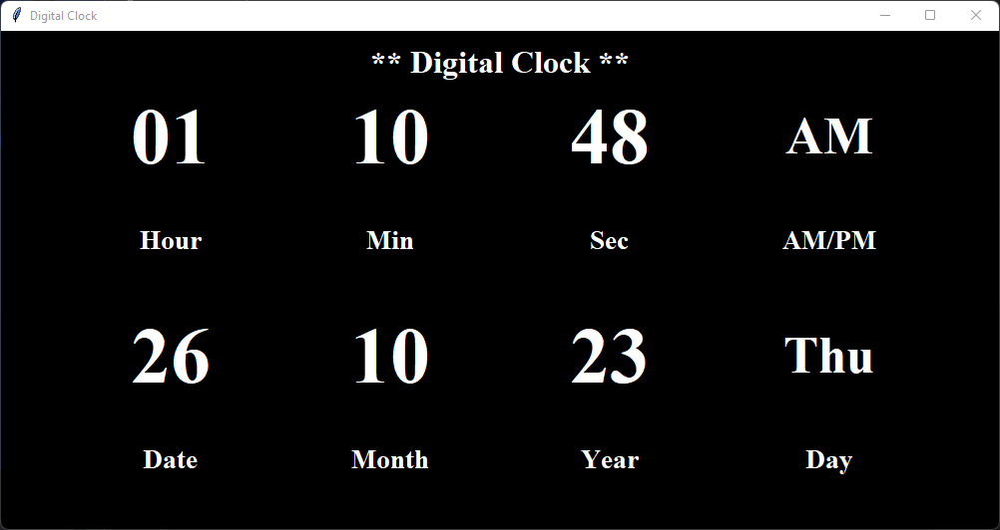

# Digital Clock - Python 

This is a simple digital clock application created in Python using the Tkinter library. It displays the current time, including hours, minutes, seconds, and AM/PM, along with the date, month, year, and day of the week. The user interface of the application is designed with a black background and white text for a sleek and modern appearance.



## Features

- Real-time display of hours, minutes, seconds, and AM/PM.
- Current date, month, year, and day of the week.
- User-friendly graphical user interface.
- Stylish design with custom fonts and colors.

## Usage

1. Make sure you have Python installed on your system.
2. Clone or download this repository to your local machine.
3. Open a terminal or command prompt and navigate to the project directory.
4. Run the `Clock.py` script using Python.

```bash
python Clock.py
```

## Acknowledgments
- Built with Python's tkinter library.
- Install datetime library.

## License
This project is open-source and available under the <a href="https://github.com/zahid60/Digital-Clock/blob/master/LICENSE">MIT License</a> . You are free to use, modify, and distribute the code as per the license terms

If you have any questions or suggestions, please feel free to open an issue or make a pull request. We appreciate your feedback!

Happy coding!❤️

